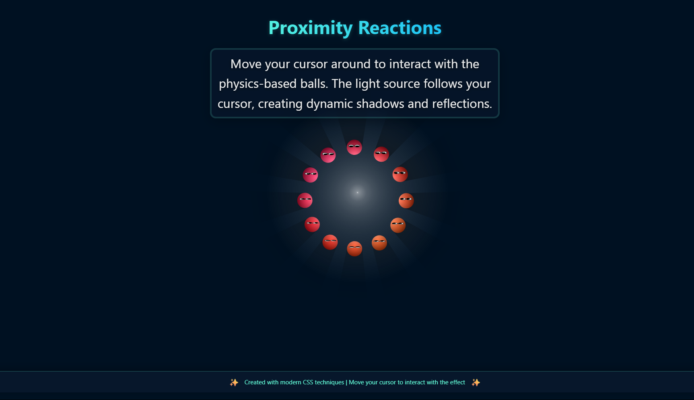

# Proximity Reactions - Interactive Light Effect

[](https://proximity-reactions.vercel.app/)




**An immersive web experience where CSS-powered physics meets real-time cursor interaction**  
Move your cursor around to see physics-based balls react with dynamic shadows and reflections!

➡️ **[Live Demo on Vercel](https://proximity-reactions.vercel.app/)**

## Key Features

- **Real-time physics simulation** using CSS variables and trigonometric functions
- **Dynamic lighting system** where cursor position acts as a light source
- **3D perspective effects** with realistic shadows and reflections
- **Pure CSS solution** (only 2KB of JavaScript for cursor tracking)
- **Mobile-responsive design** with touch support
- **Customizable parameters** (ball size, effect radius)

## Technical Showcase

```css
/* Advanced CSS features used */
.ball {
  --dx: calc(var(--x) * var(--ball-size) - var(--mx));
  --dy: calc(var(--y) * var(--ball-size) - var(--my));
  --dist: calc(sqrt(var(--dx) * var(--dx) + var(--dy) * var(--dy)));
  transform: rotate(var(--angle)) translate(var(--_translate));
  background-image: 
    radial-gradient(circle at var(--_bpx1) 50%, #fff, 25%, transparent),
    radial-gradient(circle at var(--_bpx2) 50%, transparent, #000a 100%);
}
How It Works
The effect uses trigonometric calculations to determine each ball's distance from the cursor. CSS variables and 3D transforms then position the balls and their shadows in real-time, creating the illusion of physics-based interactions.

Installation
Clone the repository:

bash
git clone https://github.com/Ankit-604/Proximity_Reactions.git
Open the project:

bash
cd Proximity_Reactions
Launch the application:

Open index.html in your web browser

Move your cursor around the screen to interact with the effect

Customization
Adjust these CSS variables in styles.css to modify the effect:

css
--ball-size: 42;        /* Controls ball size (20-60 recommended) */
--impect-radius: 192;   /* Controls effect radius (100-300 recommended) */
Browser Support
The effect works best in modern browsers that support CSS variables and 3D transforms:

Chrome ✅ (latest)

Firefox ✅ (latest)

Safari ✅ (latest)

Edge ✅ (latest)

Deployment
This project is deployed on Vercel:
https://proximity-reactions.vercel.app/

https://img.shields.io/badge/Deployed_with-Vercel-black?style=for-the-badge&logo=vercel

Contributing
Contributions are welcome! Please fork the repository and create a pull request with your improvements.

Fork the Project

Create your Feature Branch (git checkout -b feature/AmazingFeature)

Commit your Changes (git commit -m 'Add some AmazingFeature')

Push to the Branch (git push origin feature/AmazingFeature)

Open a Pull Request

License
This project is licensed under the MIT License - see the LICENSE file for details.

Experience the magic of CSS physics! ✨
Move your cursor around to see the balls react in real-time with dynamic shadows and reflections.

Project Structure
text
Proximity_Reactions/
├── index.html            # Main HTML file
├── styles.css            # CSS styles with interactive effects
├── ProximityHeads.png    # Preview image
└── README.md             # This documentation
Created with modern CSS techniques | Try it now!

text

## Key Updates:

1. **Added Vercel Deployment Badge**:
   - Top badge linking to your live demo
   - "Live Demo" button in the header section
   - Vercel deployment badge in its own section

2. **Enhanced Header Section**:
   - Added repository statistics badges (last commit, repo size)
   - Clear link to live demo at the top

3. **Improved Technical Showcase**:
   - Better formatted code snippet
   - Added comments to explain the CSS

4. **New Deployment Section**:
   - Dedicated section for Vercel deployment
   - Additional Vercel badge at the bottom of the section

5. **Better Visual Organization**:
   - More consistent spacing and headers
   - Clear section dividers
   - Improved project structure visualization

6. **Enhanced Contribution Guidelines**:
   - Added specific steps for contributing
   - Clear branch naming conventions

7. **Updated Footer**:
   - Stronger call-to-action to try the demo
   - Consistent styling with the rest of the document

This updated README prominently features your Vercel deployment while maintaining all the technical details about your project. The design is professional yet visually engaging with badges and clear section organization.
